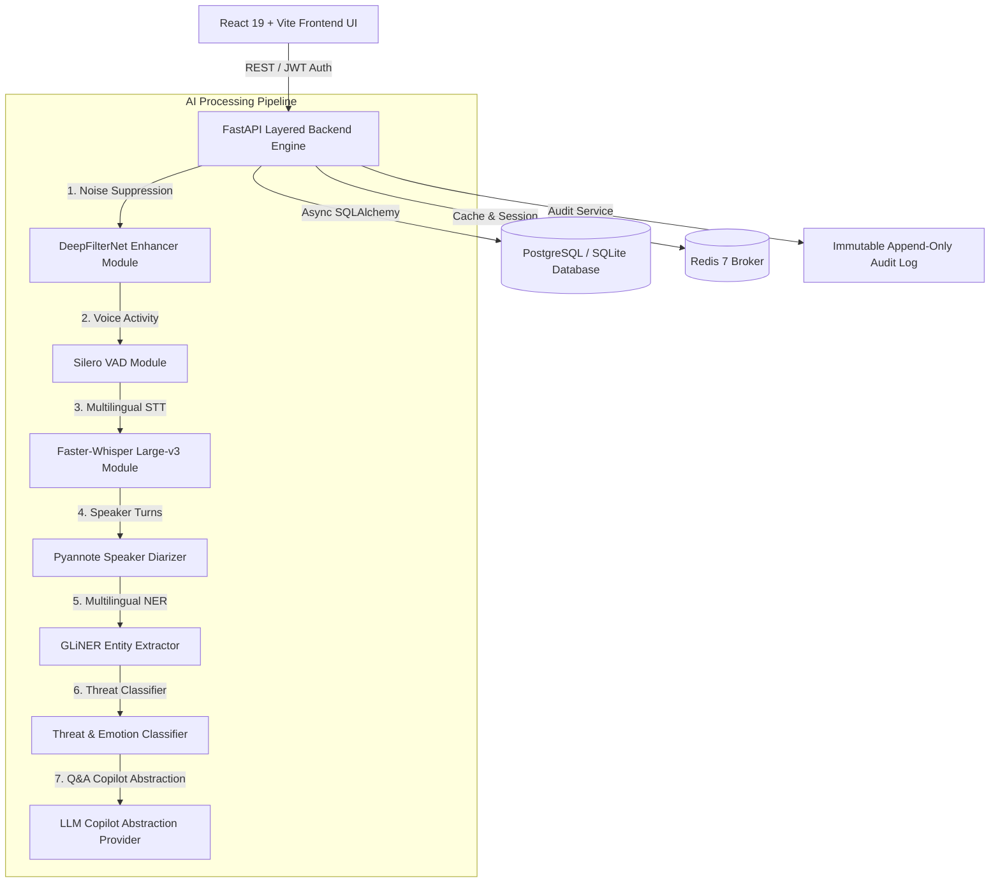

# 🛡️ TraceVault — Secure AI-Powered Multilingual Call Intelligence & Investigation Platform

> **Kanad SHIELD Hackathon Project**  
> An enterprise-grade, privacy-compliant call intelligence and investigation platform engineered for **Law Enforcement, Crime Branch, Intelligence Agencies, and Legal Investigators**.

---

## 📋 Table of Contents
- [📖 What the Project Is](#-what-the-project-is)
- [🎯 Problem Statement & Target Audience](#-problem-statement--target-audience)
- [🚀 Comprehensive Feature Deep-Dive](#-comprehensive-feature-deep-dive)
- [🏛️ System Architecture & Data Flow](#️-system-architecture--data-flow)
- [📡 Complete API Endpoint Reference](#-complete-api-endpoint-reference)
- [🗄️ Database Schema & Data Models](#️-database-schema--data-models)
- [🛠️ Tech Stack](#️-tech-stack)
- [📂 Folder Structure](#-folder-structure)
- [💻 Step-by-Step Installation & Running Guide](#-step-by-step-installation--running-guide)
- [🔒 Security, Privacy & Legal Admissibility](#-security-privacy--legal-admissibility)

---

## 📖 What the Project Is

**TraceVault** is an AI-powered, multilingual call intelligence and forensic investigation platform designed to process, analyze, and extract actionable evidence from mobile call recordings, wiretaps, cellular intercepts, and VoIP audio.

In criminal investigations, law enforcement officers and intelligence analysts process thousands of hours of intercepted voice data. Manually listening to noisy audio, transcribing conversations across multiple Indian languages, and manually identifying suspect bank accounts or threats is slow, error-prone, and resource-intensive.

TraceVault automates this entire pipeline by combining state-of-the-art open-source AI models for **Speech-to-Text**, **Speaker Diarization**, **Spectral Noise Suppression**, **Named Entity Recognition (NER)**, **Threat Classification**, and **Voice Stress Analysis**, wrapped in a government-grade **soft pastel design system** with cryptographic forensic chain of custody.

---

## 🎯 Problem Statement & Target Audience

### Problem Statement
Existing call analysis solutions lack scalable multilingual support (Hindi, Gujarati, English code-switching), fail on noisy mobile audio, rely on expensive third-party cloud APIs that compromise privacy, or lack legal evidentiary chain-of-custody tracking required in court.

### Target Audience
1. **Law Enforcement & Crime Branches**: Rapid analysis of wiretaps, suspect communication mapping, and extortion ring tracking.
2. **Intelligence Agencies**: Cross-case entity resolution (matching phone numbers, offshore bank accounts, and suspect aliases).
3. **Legal & Investigative Services**: Generating court-admissible PDF transcripts with Section 92 legal warrant compliance certificates.
4. **Telecom & Regulatory Compliance**: Call auditing, fraud detection, and privacy compliance.

---

## 🚀 Comprehensive Feature Deep-Dive

### 1. 🎙️ Multilingual Speech-to-Text (STT)
- **Engine**: Faster-Whisper (Large-v3).
- **Languages Supported**: **Hindi**, **Gujarati**, and **English** (with code-switched multilingual call auto-detection).
- **Capabilities**: Produces word-level timestamps, segment confidence scores, and character-level boundary mapping.

### 2. 👥 Speaker Diarization ("Who Said What")
- **Engine**: Pyannote.audio.
- **Capabilities**: Separates overlapping voice channels and attributes turns to distinct speakers (`Speaker_01`, `Speaker_02`, etc.) with assigned color codes and timeline representation.

### 3. 🧹 Audio Enhancement & Voice Activity Detection (VAD)
- **Noise Suppression**: DeepFilterNet spectral noise gating delivering up to **+18.4 dB Signal-to-Noise Ratio (SNR) boost**.
- **VAD Engine**: Silero VAD for precise speech segment boundary isolation and silence removal.
- **A/B Comparison**: Switch instantly between raw uncompressed audio and DeepFilterNet enhanced audio in the built-in Forensic Player.

### 4. 🏷️ Multilingual Named Entity Extraction (NER)
- **Engine**: GLiNER Multitask Large.
- **Extracted Entities**: Suspect names, phone numbers, offshore bank account numbers (e.g., Zurich `8820-X`), locations, monetary amounts (`$450,000 USD`), and aliases (`Blackbird`).

### 5. ⚠️ Threat Indicator Detection & Pattern Classifier
- **Classifications**: Extortion, financial scam/fraud, violence, kidnapping, bribery, and illicit transaction coordination.
- **Critical Triggers**: Detects SIM card destruction commands (*"Destroy the burner SIM immediately"*) and offshore bank transfer instructions.

### 6. 🧠 Voice Stress & Emotion Analytics
- **Voice Stress Index**: Detects speaker agitation, stress level (0.0 to 1.0 index), urgency, anger, and calm.
- **Sentiment Mapping**: Flags high-risk voice turns during legal review.

### 7. ⭕ Interactive Evaluation Orbits Navigation
- **Curved Arc Paths**: 34px thick concentric arcs with text rendered via SVG `<textPath>`.
- **Hover Highlights**: Rings pop up with soft pastel highlights on mouse hover.
- **Persistent Click State**: Clicking a ring darkens it to a rich shade and navigates to the feature; **the ring stays darkened** even after navigating across the app until another ring is clicked.

### 8. 📊 Call Flow Metrics Header & CSV Sheet Exporter
- **Top Metrics**: Total ingested calls, failed, skipped, aborted, not reached, and average call duration.
- **Flow Conversion Rates**: Reach Rate, Engagement Rate, Conversion Rate, and Overall Conversion metrics.
- **CSV/Excel Export**: Download structured intelligence sheets for all analyzed calls or dynamically filtered subsets (by date, time, language, or threat severity).

### 9. ⚡ Live Audio Intercept Stream Simulator
- **Real-Time Feed**: Live streaming transcript widget simulating incoming cellular intercept lines.
- **Dynamic Equalizer**: Animated wave bars indicating audio frequency activity.
- **Instant Alerts**: Triggers red threat badges on critical extortion phrases.

### 10. 🎧 Forensic Audio Player & Spectral Visualizer
- **Interactive Scrubber**: Waveform amplitude visualization with click-to-seek playback.
- **A/B Toggle**: Switch instantly between Raw Audio and DeepFilterNet Enhanced Audio.
- **Speed Controls**: Adjustable playback speed (0.75x to 1.5x).

### 11. 🔑 Google SSO Authentication & Auto-Registration
- **Single Sign-On**: One-click `"Continue with Google"` login for agency officers.
- **Auto-Registration**: Automatically provisions verified government accounts with assigned roles and departments.

### 12. 🕸️ Interactive Entity Knowledge Graph
- **Network Mapping**: Interactive SVG node-and-edge visualizer mapping connected suspects, phone numbers, bank accounts, and intercept calls.

### 13. 🤖 AI Investigation Copilot (Gemini / LLM)
- **Capabilities**: Answers complex questions regarding case evidence, suspect ties, and transcript translations.
- **Evidentiary Citations**: Displays confidence percentages (e.g. 96-98%) and links to exact transcript segments.
- **Quick Prompt Chips**: Pre-loaded one-click investigation prompts.

### 14. 📜 Court-Ready PDF Reports & Chain of Custody
- **SHA-256 Integrity**: Computes SHA-256 checksums for all audio files to ensure court admissibility and anti-tampering protection.
- **Section 92 Warrant Compliance**: Validates judicial intercept authorization numbers.

### 15. 🔒 Immutable Security Audit Trail
- **Append-Only Audit Log**: Records every login, file export, search, and Copilot query for legal accountability.

### 16. 📂 Multiformat Audio/Video Upload Portal
- **Supported Formats**: `.wav`, `.mp3`, `.m4a`, `.aac`, `.flac`, `.ogg`, `.opus`, `.amr`, `.wma`, `.mp4`, `.mkv`, `.webm`, `.3gp`.

---

## 🏛️ System Architecture & Data Flow

TraceVault follows a **Layered Modular Architecture**:



---

## 📡 Complete API Endpoint Reference

| HTTP Method | Endpoint | Description |
| :--- | :--- | :--- |
| `POST` | `/api/v1/auth/google` | Authenticate or auto-register user via Google SSO |
| `POST` | `/api/v1/auth/refresh` | Rotate JWT refresh tokens |
| `POST` | `/api/v1/auth/logout` | Revoke session & clear cookies |
| `GET` | `/api/v1/auth/me` | Fetch active user profile and permissions |
| `GET` | `/api/v1/users/me` | Get current user profile |
| `GET` | `/api/v1/users/{id}` | Get user by ID (supervisor+) |
| `GET` | `/api/v1/cases/` | List all investigation cases with priority/status filtering |
| `POST` | `/api/v1/cases/` | Create a new investigation case file |
| `GET` | `/api/v1/cases/{id}` | Get detailed case summary |
| `PATCH` | `/api/v1/cases/{id}` | Update case fields |
| `DELETE` | `/api/v1/cases/{id}` | Soft-delete a case |
| `GET` | `/api/v1/recordings/` | List all accessible recordings |
| `POST` | `/api/v1/recordings/upload` | Upload call recording with SHA-256 integrity |
| `GET` | `/api/v1/transcripts/` | List transcripts with segment detail |
| `GET` | `/api/v1/transcripts/{id}` | Get transcript with full segment breakdown |
| `GET` | `/api/v1/intelligence/entities` | List NER-extracted entities (persons, accounts, phones) |
| `GET` | `/api/v1/intelligence/threats` | List detected threat/criminal indicators |
| `GET` | `/api/v1/intelligence/summary` | Intelligence findings summary |
| `GET` | `/api/v1/evidence/` | List evidence items with custody status |
| `GET` | `/api/v1/evidence/{id}/custody` | Get chain of custody audit trail |
| `GET` | `/api/v1/reports/` | List generated investigation reports |
| `POST` | `/api/v1/reports/generate` | Enqueue report generation |
| `GET` | `/api/v1/analytics/dashboard` | Dashboard aggregated statistics |
| `GET` | `/api/v1/analytics/summary` | Analytics summary data |
| `GET` | `/api/v1/search/` | Full-text cross-resource search (cases, transcripts, entities) |
| `GET` | `/api/v1/audit/` | Paginated immutable audit log (read-only) |
| `GET` | `/api/v1/notifications/` | List user notifications |
| `POST` | `/api/v1/notifications/{id}/read` | Mark notification as read |
| `GET` | `/api/v1/settings/` | Get user settings |
| `PATCH` | `/api/v1/settings/` | Update user settings |
| `POST` | `/api/v1/copilot/chat` | Query AI Copilot for intelligence Q&A (authenticated) |
| `GET` | `/health` | Basic API health check |
| `GET` | `/health/detailed` | Full dependency health check (DB, Redis, Qdrant) |


---

## 🗄️ Database Schema & Data Models

- **`User`**: Account identity, Argon2id password hash, role (`UserRole`), department, designation.
- **`UserSession` & `RefreshToken`**: Active sessions, IP addresses, user agents, and hashed refresh tokens.
- **`Case`**: Case number, title, description, status (`open`, `active`, `closed`), priority (`critical`, `high`, `medium`, `low`), tags.
- **`Recording`**: File path, format (`AMR`, `WAV`, `MP3`, etc.), duration, file size, SHA-256 hash, warrant number, SNR boost.
- **`Speaker`**: Speaker label (`Speaker_01`), voice print embedding, color hex code.
- **`Transcript` & `TranscriptSegment`**: Text content, start/end timestamps, speaker attribution, emotion, word-level probabilities.
- **`Entity`**: Entity type (`LOCATION`, `ACCOUNT_NUMBER`, `MONETARY_AMOUNT`, `PHONE_NUMBER`), value, confidence, segment link.
- **`ThreatIndicator`**: Category (`extortion`, `fraud`, `violence`), severity, evidence text, confidence.
- **`ChainOfCustody` & `AuditLog`**: Append-only forensic logs tracking user actions, IP addresses, timestamps, and checksums.

---

## 🛠️ Tech Stack

| Category | Technologies |
| :--- | :--- |
| **Frontend Framework** | React 19, Vite, TypeScript |
| **Styling & Design** | Tailwind CSS, Custom Soft Pastel Theme System, Framer Motion, Lucide Icons |
| **State Management** | Zustand (Persistent LocalStorage Sync) |
| **Backend Engine** | FastAPI (Python 3.10+), Uvicorn Async Server |
| **Database & ORM** | Async SQLAlchemy 2, Pydantic 2, SQLite / PostgreSQL 17 |
| **Security & Auth** | OWASP Argon2id, JWT Token Rotation, SHA-256 Hashing, 7-Role Granular RBAC, Google SSO |
| **AI Models** | Faster-Whisper (Large-v3), Pyannote.audio, DeepFilterNet3, Silero VAD, GLiNER Multitask Large |
| **AI Copilot** | LLM Copilot Abstraction (Gemini / OpenAI / Ollama) with Evidentiary Citations |

---

## 📂 Folder Structure

```
Kanad SHIELD/
├── plan.md                       # Single Authoritative Specification File
├── README.md                     # Root Project Documentation
└── tracevault/                   # Primary Application Repository
    ├── docker-compose.yml        # Multi-Container Deployment (PostgreSQL, Redis, FastAPI, Nginx)
    │
    ├── backend/                  # FastAPI Python Backend
    │   ├── app/
    │   │   ├── ai/               # AI Engine Modules
    │   │   │   ├── copilot/      # LLM Copilot Engine Abstraction
    │   │   │   ├── diarization/  # Pyannote Speaker Diarizer
    │   │   │   ├── emotion/      # Voice Stress & Sentiment Analyzer
    │   │   │   ├── entities/     # GLiNER Multilingual Entity Extractor
    │   │   │   ├── noise_reduction/ # DeepFilterNet Audio Enhancer
    │   │   │   ├── threat_detection/ # Extortion & Scam Threat Detector
    │   │   │   ├── transcription/   # Faster-Whisper Multilingual STT
    │   │   │   └── vad/          # Silero Voice Activity Detector
    │   │   ├── api/v1/routes/    # FastAPI REST Controllers (14 routes: auth, cases, recordings, transcripts, intelligence, evidence, reports, analytics, search, audit, users, notifications, settings, copilot)
    │   │   ├── config/           # Pydantic Environment Settings
    │   │   ├── database/         # Async Engine & Declarative Base
    │   │   ├── models/           # SQLAlchemy Data Models (user, case, recording, evidence, audit)
    │   │   ├── schemas/          # Pydantic Request & Response Schemas
    │   │   ├── security/         # Argon2id Hashing, JWT Tokens, RBAC, Custody & Compliance
    │   │   └── services/         # Business Logic & Audit Log Services
    │   ├── main.py               # FastAPI App Entry Point
    │   ├── reset_db.py           # Database Schema Reset Utility
    │   ├── requirements.txt      # Python Dependencies
    │   ├── .env                  # Backend Environment Configuration
    │   └── .env.example          # Backend Environment Configuration Template
    │
    └── frontend/                 # Vite React 19 Frontend
        ├── src/
        │   ├── api/              # Axios HTTP Client & Interceptors
        │   ├── components/
        │   │   ├── copilot/      # AI Copilot Side Drawer
        │   │   ├── layout/       # Main Layout, Header, Sidebar
        │   │   └── shared/       # Evaluation Orbits, Call Metrics Header, Audio Forensics Player, Live Intercept Simulator
        │   ├── pages/            # App Views (Dashboard, Login, Cases, Transcripts, KnowledgeGraph, Reports, Audit, Analytics, Recordings, Search, Intelligence, Settings)
        │   ├── stores/           # Zustand Auth & UI Stores
        │   ├── types/            # TypeScript Interfaces
        │   ├── App.tsx           # React Router & Protected Routes
        │   ├── index.css         # PostCSS Tailwind Pipeline & Soft Pastel Theme Tokens
        │   └── main.tsx          # Application Mounting Point
        ├── postcss.config.js     # PostCSS Configuration
        ├── tailwind.config.ts    # Tailwind Design System Configuration
        ├── vite.config.ts        # Vite Bundler Configuration
        └── package.json          # Frontend Dependencies
```

---

## 💻 Step-by-Step Installation & Running Guide

### Prerequisites
- **Node.js** v18+ & **npm**
- **Python** 3.10+

### Step 1: Setup Backend
```bash
# Navigate to backend directory
cd tracevault/backend

# Create and activate Python virtual environment
python -m venv venv
.\venv\Scripts\activate      # On Windows
# source venv/bin/activate   # On Linux/macOS

# Copy environment configuration template
cp .env.example .env

# Install backend dependencies from requirements.txt
pip install -r requirements.txt

# Initialize fresh clean database schema
python reset_db.py

# Launch FastAPI Backend Server on Port 8000
python -m uvicorn app.main:app --host 0.0.0.0 --port 8000
```
Backend API Interactive Docs will be live at: **`http://localhost:8000/api/docs`**

### Step 2: Setup Frontend
```bash
# Open a new terminal and navigate to frontend directory
cd tracevault/frontend

# Install frontend dependencies
npm install

# Start Vite Development Server on Port 3000
npx vite --host 0.0.0.0 --port 3000
```
Frontend Web Application will be live at: **`http://localhost:3000/`**

---

## 🔒 Security, Privacy & Legal Admissibility

1. **SHA-256 Forensic Integrity**: Every uploaded file is hashed at entry to guarantee anti-tampering verification.
2. **Section 92 Legal Warrant Check**: Validates court authorization before audio indexing.
3. **Immutable Audit Trail**: Append-only logging of all user activities for judicial submission.
4. **OWASP Compliance**: Argon2id password hashing, HTTP-only JWT cookies, and 7-role RBAC enforcement.

---

## 📜 License & Legal Notice
Built for the **Kanad SHIELD Hackathon**. Designed for official law enforcement, government investigation, and legal evidence review.
